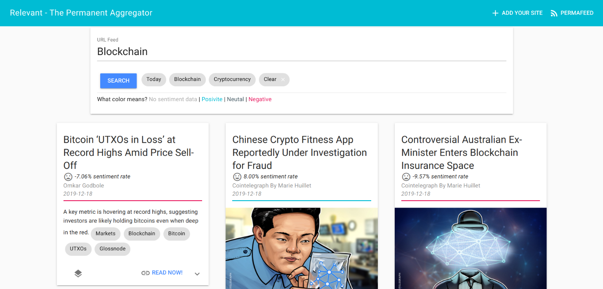

# Relevant

Address: [UNOS__VCYTkpd9bxvI5C8ATZw6qIc1SMYfA01v9rxIQ
](https://viewblock.io/arweave/address/UNOS__VCYTkpd9bxvI5C8ATZw6qIc1SMYfA01v9rxIQ)

It is a community permafeed aggregator powered by the Arweave, Hapi.js, and Vue with a twist of sentiment analysis.
You can explore posts using **dates**, **categories**, **sentiment**, **reading time**, **language**, **author** and more. 

Why this is interesting, well maybe you need to make a decision based on the current state of the ecosystem or maybe do you need to understand why the cryptocurrentins are falling down today, or have a good time reading news, or practice reading news in another language. So having this information and making more visible the perception of the sentiment, will help to gain knowledge, take a decision, stay updated with news that the community considered **relevant** or just having fun.


## Specification
Each element of the feed will have the following attributes, let's divide the spect in two parts:

### 1. Tags
The tags have the following attributes:
1. Feed-Name: **String** Relevant is the name of the feed.
2. Feed-Version: **String** Relevant at this moment, is in version **1.0**. Posible elements to increment the version will be adding atrributes, changing the algorithm, etc.
3. Sentiment-Rate: **Integer** The analisis have a range of -5 to 5 to measure the sentiment of the post, this data is rounded, to exact rate see the body estructure
4. Sentiment-Group: **String Options(Pessimistic, Optimistic, Neutral)** Instead of using numbers is also posible query for post using groups where Pessimistic will be Sentiment-Rate less than -1, Optimistic when Sentiment-Rate greater than 1 and Neutral between -1,1.
5. Publication-Date: **String** This is the date when the post was publised, has the format YYYY-MM-DD
6. Publication-Time: **String** This is the time when the post was publised, has the format HH:MM
7. Publication-Feed: **String** This is a URL of the feed that is queried every hour to retrieve the most recent posts
8. URL: **String** Indicate the url of the current post
9. Language: **String** Is the language that the post manages
10. Publication-Author: **String** To know who is the mind or minds betwwen this resource
11. Category-0: **String** Category of the post, this is provided by the authors
12. Category-1: **String** Category of the post, this is provided by the authors
13. Category-2: **String** Category of the post, this is provided by the authors
14. Category-3: **String** Category of the post, this is provided by the authors
16. Category-4: **String** Category of the post, this is provided by the authors
16. Content-Type: **String** The format in which the data is stored, only ‘application/json’
17. Copyright’: **Boolean** Indicates if the current corrent is published with copyrights

### 2. Body Structure

1. content: **String** This is the actual content of the post
2. title: **String** Title provided in the metatags
3. link: **String** Url to identify the resource
4. guid: **String** Universal or permanent url to identify the resource
5. publicationDate: **String** Full Publication date time ISO 8601
6. author: **String** The author of the content
7. site: **Object** To easy access the site data is encapsulated also in the body
   - description: **String** The description of the site
   - title": **String** The name of the site
   - copyright: **Boolean** Indicates if the data provided by the site has copyrights
8. readingStats: **Object** To busy people we provided the estimated time to read the content
    - text: **String** The estimated time in human format
    - minutes: **Float** Time in minutes
    - time: **Integer** time in milliseconds
    - words: **Integer** The number of words in the content
9. sentiment: **Object** Sentiment rate with out modification
   - rate: **Float** Exact rate for sentiment analysis
   - group: **String Options(Pessimistic, Optimistic, Neutral)** Instead of using numbers is also posible query for post using groups where Pessimistic will be Sentiment-Rate less than -1, Optimistic when Sentiment-Rate greater than 1 and Neutral between -1,1.
10. description: **String** Meta description of the post
11. categories: **Array[String]** Full array of categories
9. media: **Object** If the post have a thumbanail or image, this describe such element
  - url: **String** URL of the image
  - length: **Integer** Length in bytes of the image
  - type: **String** Content Type of the image
  

## Examples

### 1. Query for all categories
Lets suppose we want retrieve the posts releated to bitcoin, to do this let's create a query for each category and each category will be compared with the word 'bitcoin':

```graphql
query RelevantSearchByCategory($category: String! =  "bitcoin"){
  category_0: transactions(tags: [{name: "Feed-Name", value: "Relevant"}, {name: "Category_1", value: $category}]) { ...categoriesMatch },
  category_1: transactions(tags: [{name: "Feed-Name", value: "Relevant"}, {name: "Category_0", value: $category}]) { ...categoriesMatch },
   category_2: transactions(tags: [{name: "Feed-Name", value: "Relevant"}, {name: "Category_2", value: $category}]) { ...categoriesMatch },
  category_3: transactions(tags: [{name: "Feed-Name", value: "Relevant"}, {name: "Category_3", value: $category}]) { ...categoriesMatch }
}

fragment categoriesMatch on Transaction {
  id,
  tags {
    name
    value
  }
}
```

This will produce an out similat to this: 
```
{
	"data": {
  "category_0": {...},
  "category_1": {...},
  "category_2": {...},
  "category_3": {...}
  }
}
```

### 2. Little time to read
Also if you have little time to read, lets choose posts with an estimated time of one minute:

```graphql
query {
  transactions(tags: [
    {name: "Feed-Name", value: "Relevant"}, 
    {name: "Reading-Time", value: "1"}]) { 
    id,
    tags {
      name
      value
    }
  }  
}
```

### 3. Learning a new language and remain impartial about blockchain
```graphql
query {
  category_0: transactions(tags: [
    {name: "Feed-Name", value: "Relevant"}, 
    {name: "Publication-Lang", value: "ES"},
    {name: "Sentiment-Group", value: "Neutral"},
    {name: "Category_0", value: "blockchain"}
  ]) { id, tags { name, value}},
  category_1: transactions(tags: [
    {name: "Feed-Name", value: "Relevant"}, 
    {name: "Publication-Lang", value: "ES"},
    {name: "Sentiment-Group", value: "Neutral"},
    {name: "Category_1", value: "blockchain"}
  ]) { id, tags { name, value}},
  category_2: transactions(tags: [
    {name: "Feed-Name", value: "Relevant"}, 
    {name: "Publication-Lang", value: "ES"},
    {name: "Sentiment-Group", value: "Neutral"},
    {name: "Category_2", value: "blockchain"}
  ]) { id, tags { name, value}},
  category_3: transactions(tags: [
    {name: "Feed-Name", value: "Relevant"}, 
    {name: "Publication-Lang", value: "ES"},
    {name: "Sentiment-Group", value: "Neutral"},
    {name: "Category_3", value: "blockchain"}
  ]) { id, tags { name, value}},
  category_4: transactions(tags: [
    {name: "Feed-Name", value: "Relevant"}, 
    {name: "Publication-Lang", value: "ES"},
    {name: "Sentiment-Group", value: "Neutral"},
    {name: "Category_4", value: "blockchain"}
  ]) { id, tags { name, value}}
}

```

## 4. What the people says when the the bitcoin, eth, and other crypto increase the its value

Since January 13th, 2019 to today January 17th, 2019 the value of BTC and ETH has increase its value, so what the people says when all begins:

```graphql
query {
  neutral: transactions(tags: [
    {name: "Feed-Name", value: "Relevant"}, 
    {name: "Publication-Date", value: "2020-01-13"},
  ]) { id, tags { name, value}},
}
```

## Install dependencies

```
yarn install
```

The project stores info about the sites to haverst its feed, So we need to up mongo to store such data as following:
```
docker run -d -p 127.0.0.1:27017:27017 --name mongo mongo
```


## Run the server
Before start the permafeed agregator/app ensure you have enough funds to save posts/news to Arwaeave!
```
node main.js -w wallet.json -p 80 -H 0.0.0.0
```

If you have some error with respect to insecure content I recommend use certbot and nginx to configure ssl certificates. Go this site for more details: https://certbot.eff.org/lets-encrypt/ubuntubionic-nginx
Also, you can open an issue in this repo to provide this configuration.

**Run your instance and give them a thematic**
My instance is focusing on stay relevant in the crypto ecosystem adding news sites, technical posts from arweave medium, gitcoin blog , and so on.

## Funtionality
1. Add your feed url, the harvest of the seed takes one hour to search for new news. So maybe in an hour or less the site will start requesting your feed data.


As a side note, you can submit again your site to force harvest the feed.

2. Wait patiently or just have fun with the current posts.



The current instance have already this feeds but could take a while that each site listed here take at least one post published:

1. https://www.coindesk.com/feed
2. https://cointelegraph.com/rss
3. https://toshitimes.com/feed/
4. https://www.newsbtc.com/feed/
5. https://coinidol.com/rss2/
5. https://cryptobriefing.com/feed/
6. https://btcmanager.com/feed/
7. https://dailyhodl.com/feed/
8. https://www.theblockcrypto.com/rss.xml
9. https://www.cryptoglobe.com/latest/feed/
10. https://www.coinspeaker.com/feed/
11. https://insidebitcoins.com/feed
12. http://dippli.com/feed/
13. https://www.btcwires.com/feed/
14. https://www.the-blockchain.com/feed/
15. https://coinfrenzy.io/feed/

Spanish
1. https://www.diariobitcoin.com/index.php/feed
2. https://es.cointelegraph.com/rss
3. https://www.criptonoticias.com/feed/
4. https://observatorioblockchain.com/feed/
5. https://cryptomagazine.co/feed/
6. https://criptotendencia.com/feed/

Italian
1. https://it.cointelegraph.com/rss
2. https://it.coinidol.com/rssshort/
3. https://it.cryptonews.com/news/feed

French
1. https://cryptonaute.fr/feed/
2. https://fr.cryptonews.com/news/feed
3. https://blockchainfrance.net/feed/

## License
See [LICENSE](/LICENSE)
